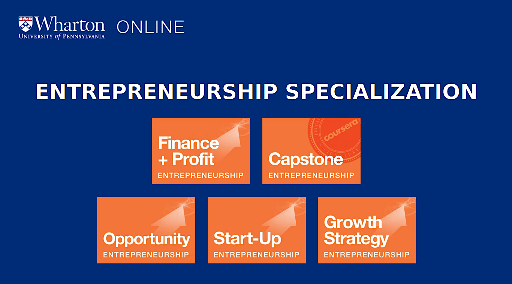

# Wharton Online Entrepreneurship Specialization

Welcome! I recently completed the **Entrepreneurship Specialization** certificate program offered by the University of Pennsylvania’s Wharton School through Coursera Learning Platform. Over the course of the five-course series, I took detailed notes with the goal of creating a comprehensive reference resource for anyone interested in **Entrepreneurship** or **Techpreneurship**. Enjoy!

---

## 📚 Overview

The Wharton Entrepreneurship Specialization is a five-course program, that guides learners through the process of launching and growing a startup. Taught by renowned Wharton faculty, the specialization covers ideation, validation, launching, scaling, and financing new ventures.

- **Provider:** University of Pennsylvania (Wharton School)
- **Learning Platform:** [Wharton Online/Coursera](https://platform.onlinelearning.upenn.edu/offering/entrepreneurship-specialization-a0Q2E00000JmMP5UAN)
- **Format:** 100% Online, Self-paced
- **Duration:** ~6 months (2 hours/week recommended)
- **Specialization Certificate:** Yes (upon completions, of the 5-courses & required Capstone Project)

---

## 🏆 Who Should Enroll?

- Aspiring "Techpreneurs and Founders"
- Innovators and Intrapreneurs
- Business professionals and students
- Anyone interested in the startup process

---

## 🗂️ Specialization Structure

The specialization consists of **five sequential courses**:

| # | Course Title                                      | Focus Areas |
|---|---------------------------------------------------|-------------|
| 1 | **Developing the Opportunity**                    | Opportunity recognition, market analysis, customer discovery, ideation |
| 2 | **Launching Your Start-Up**                       | Lean startup, MVP, team building, pitching, legal basics |
| 3 | **Growth Strategies**                             | Scaling, customer acquisition, partnerships, growth models |
| 4 | **Financing and Profitability**                   | Funding sources, financial planning, profitability, exit strategies |
| 5 | **Wharton Entrepreneurship Capstone**             | Real-world project: business plan or investor pitch |

---

## 🎯 Learning Outcomes

- **Entrepreneurial Mindset:** Cultivate the skills and perspectives needed to identify and pursue new business opportunities.
- **Opportunity Assessment:** Evaluate ideas, analyze markets, and validate business concepts.
- **Startup Launch:** Apply lean startup principles, build teams, and navigate early-stage challenges.
- **Growth & Scaling:** Develop strategies for acquiring customers and scaling operations.
- **Startup Financing:** Understand funding options, financial management, and exit planning.
- **Capstone Project:** Synthesize your learning into a real-world business plan or pitch.

---

## 🛠️ Skills You Will Gain

- Business Model Development
- Market Analysis & Customer Insights
- Lean Startup & MVP Creation
- Team Building & Leadership
- Strategic Growth Planning
- Startup Financing & Profitability
- Pitching & Communication
- Innovation & Problem Solving

---

## 👨‍🏫 Instructors

Courses are taught by top Wharton faculty, including:

- [Lori Rosenkopf](https://mgmt.wharton.upenn.edu/profile/rosenkol)
- [David Hsu](https://mgmt.wharton.upenn.edu/profile/dhsu)
- [Karl Ulrich](https://oid.wharton.upenn.edu/profile/ulrich)
- [Ethan Mollick](https://mgmt.wharton.upenn.edu/profile/emollick)
- [Kartik Hosanagar](https://oid.wharton.upenn.edu/profile/kartikh)
- [Jagmohan Raju](https://marketing.wharton.upenn.edu/profile/rajuj)

---

## 📜 License

This README is for informational purposes only and is not officially affiliated with the University of Pennsylvania or Coursera.
